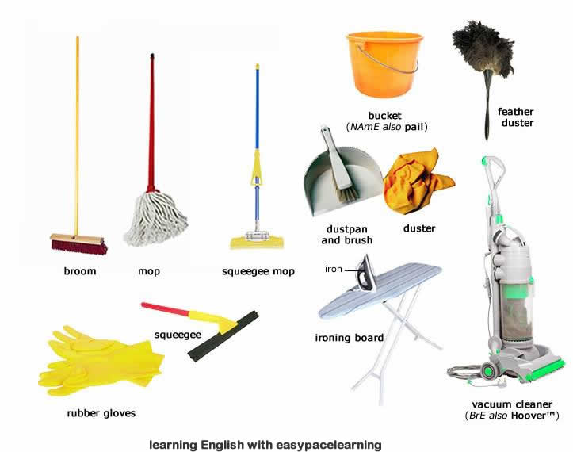

# 🧹 Apex Cleaners - Professional Cleaning Services

## 🌐 Live Website
**[apexcleaners.github.io/APEX-CLEANERS](https://apexcleaners.github.io/APEX-CLEANERS/)**

---

## 📍 About Us

Apex Cleaners is a professional cleaning service based in **Zimunya, Mutare, Zimbabwe**. We provide eco-friendly home, office, and commercial cleaning with a **100% satisfaction guarantee**.

### Why Choose Us:
- 🛡️ Insured & Bonded
- ✅ Background-Checked Team
- 🌿 Eco-Friendly Products
- 💯 100% Satisfaction Guarantee
- 💵 Payment After Service

---

## 🛠️ Our Services

| Service | Description |
|---------|-------------|
| 🏠 House Cleaning | Regular home cleaning & maintenance |
| 🧹 Deep Cleaning | Comprehensive deep clean for homes & offices |
| 🏢 Office Cleaning | Commercial & workplace sanitization |
| 🚚 Move In/Out | Full cleaning for moving transitions |
| 🔨 Post-Renovation | Construction dust & debris removal |
| 🎉 Post-Event | Party & event cleanup |
| 🏊 Specialized | Pools, sofas, carpets, mats |

---

## 📍 Service Areas

We serve **Mutare** and all major suburbs:

City Centre • Sakubva • Dangamvura • Chikanga • Hobhouse • Murambi • Fairbridge Park • Yeovil • Zimta Park • Greenside • Weirmouth • Riverside • Gimboki • Darlington • Morningside

🚀 **Coming soon:** Chipinge & Chimanimani

---

## 👥 Our Team

| Name | Role |
|------|------|
| Leon Tadiwanashe Chaperuka | Founder & Lead Cleaner |
| Decide Muchapireyi | Founder & Lead Cleaner |
| Mrs Muchapireyi | Operations Manager |
| Mr John | Lead Cleaner |
| Mr Doka | Team Adviser |

---

## 💰 Payment Methods

- 💵 Cash
- 📱 EcoCash
- 🏦 Mukuru
- 📲 InnBucks

Payment is made **after the service** is completed.

---

## 🕐 Business Hours

| Day | Hours |
|-----|-------|
| Monday - Sunday | 6:00 AM – 8:00 PM |

---

## 📞 Contact Us

| Channel | Link |
|---------|------|
| 📧 Email | [apexcleaners2026@gmail.com](mailto:apexcleaners2026@gmail.com) |
| 💬 WhatsApp John | [+263 71 736 6292](https://wa.me/263717366292) |
| 💬 WhatsApp Mrs Muchapireyi | [+263 77 337 0991](https://wa.me/263773370991) |
| 💬 WhatsApp Decide | [+263 78 130 0075](https://wa.me/263781300075) |
| 💬 WhatsApp Leon | [+263 77 928 7409](https://wa.me/263779287409) |
| 💼 LinkedIn | [Justice Nyazika](https://www.linkedin.com/in/justice-nyazika-146041267) |

---

## 🔍 Track Your Booking

Already booked? Track your service status here:
👉 [Track Booking](https://apexcleaners.github.io/APEX-CLEANERS/track-booking.html)

---

## 📄 Privacy Policy

Read our [Privacy Policy](https://apexcleaners.github.io/APEX-CLEANERS/privacy.html)

---

## 🛠️ Tech Stack

- **Frontend:** HTML5, Tailwind CSS, JavaScript
- **Backend:** Firebase (Firestore, Auth)
- **Email:** EmailJS
- **Hosting:** GitHub Pages

---

© 2026 Apex Cleaners. All rights reserved.
